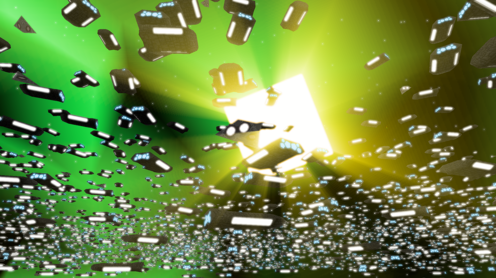

# todo

* proper ui
* allow for ship construction from minerals
* health bars?
* resize ships
* a way to choose formations.
* improved movement system
* evasion/fleeing is kinda wierd and hard to get right - consider removing.
* use tlas for choose enemy target - need to store position and side.
